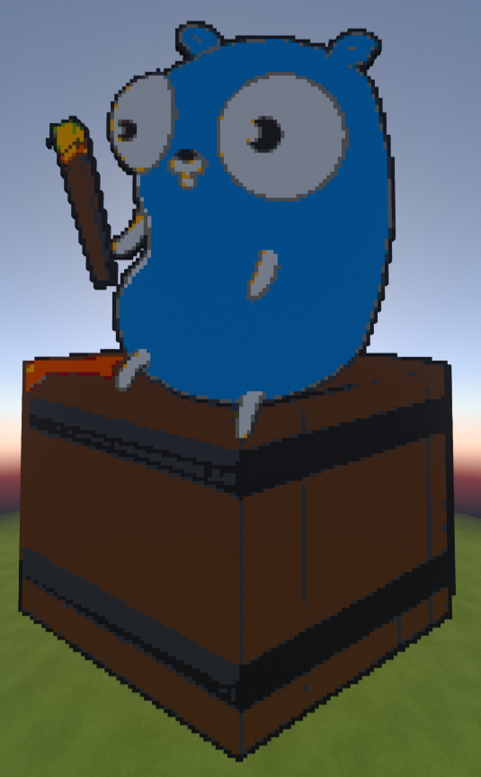

# pixelart
A pixel art image generator for Dragonfly.

## Usage
Drop an image into the working directory, start up Dragonfly, and run `/image mascot.png`.
It should generate the image 50 blocks in front of you.

## Examples

|                 Image                  |                  In Game                   |
|:--------------------------------------:|:------------------------------------------:|
|                       |            |
|                |            |
|                |            |